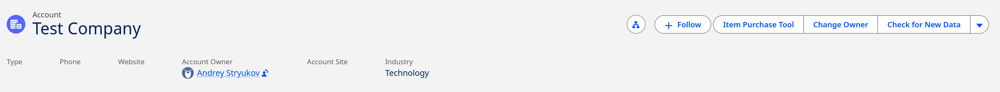
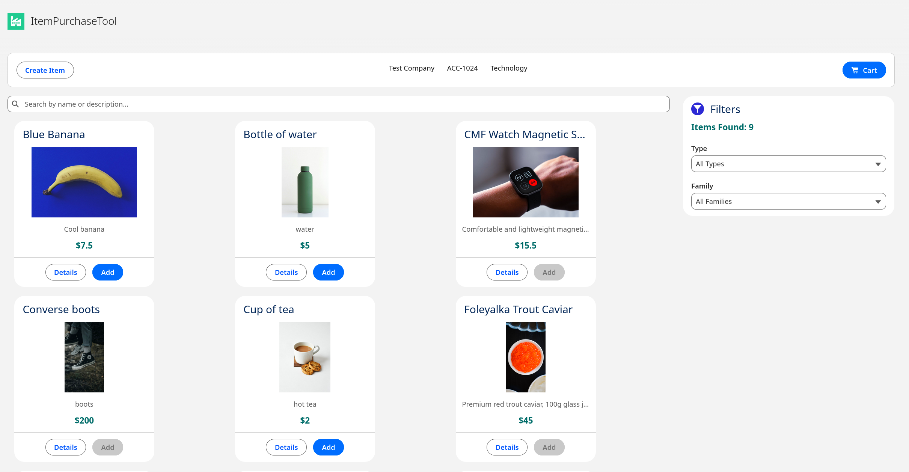
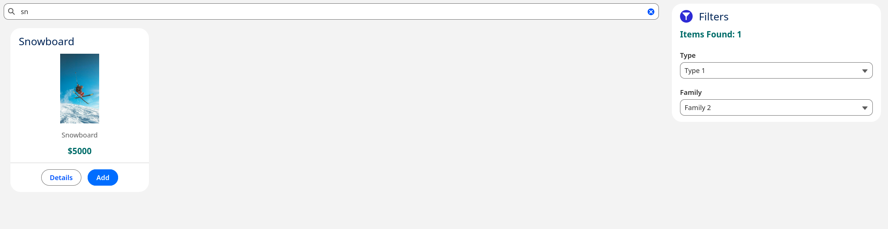
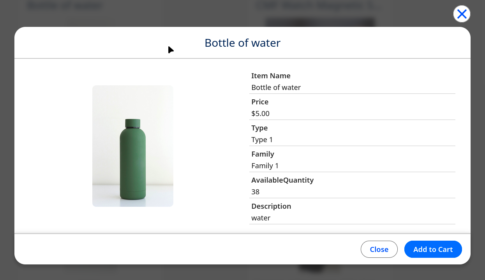
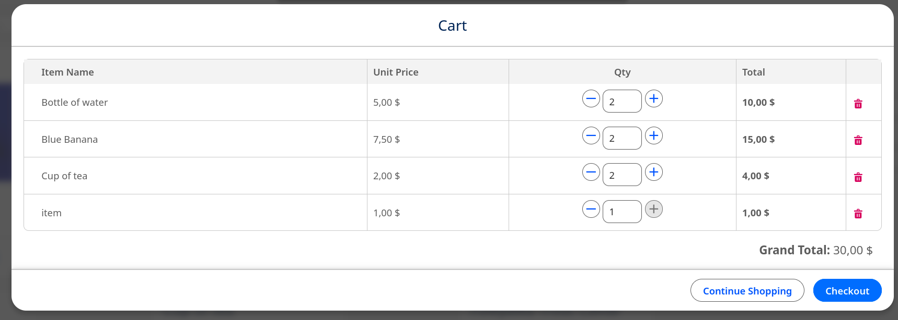
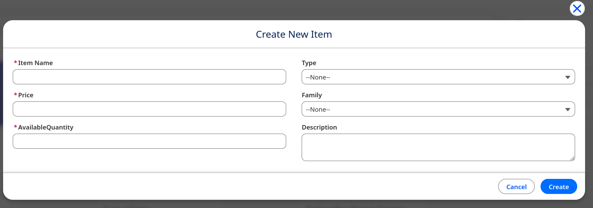

# Item Purchase Tool — Salesforce LWC Application

> A full-stack Salesforce application built with Lightning Web Components (LWC) and Apex, implemented as a technical assignment for a Salesforce Developer position.

---

## Table of Contents

- [Project Overview](#-project-overview)
- [Technical Requirements Fulfillment](#-technical-requirements-fulfillment)
- [Screenshots](#-screenshots)
- [Architecture Overview](#️-architecture-overview)
- [Key Architectural Decisions &amp; Rationale](#-key-architectural-decisions--rationale)
- [Trade-offs, Pros &amp; Cons](#-trade-offs-pros--cons)
- [Comparison with Enterprise Projects](#-comparison-with-enterprise-projects)
- [Project Structure](#-project-structure)
- [Local Setup &amp; Deployment Guide](#-local-setup--deployment-guide)
- [Running Tests](#-running-tests)
- [Development Tooling](#-development-tooling)

---

## Project Overview

**Item Purchase Tool** is a Lightning App Page-based application that allows internal sales representatives to browse an item catalog, manage a shopping cart, and process purchases — all from within the standard Salesforce Account page context. Managers have an additional capability to create new catalog items with automatic image enrichment via the Unsplash API.

The project was developed iteratively following a GitHub Issues → Pull Request workflow, demonstrating professional Salesforce DX project management practices.

---

## Technical Requirements Fulfillment

| #   | Requirement                                                | Status | Implementation                                                                                                  |
| --- | ---------------------------------------------------------- | ------ | --------------------------------------------------------------------------------------------------------------- |
| 1   | Custom objects:`Item__c`, `Purchase__c`, `PurchaseLine__c` | ✅     | Data model with all required fields and relationships                                                           |
| 2   | `IsManager__c` field on standard `User` object             | ✅     | Custom checkbox field; drives authorization                                                                     |
| 3   | Lightning App Page accessible from Account button          | ✅     | `ItemPurchaseTool.flexipage`, custom Detail Page Button with `c__accountId` parameter                           |
| 4   | Account summary display (Name, Number, Industry)           | ✅     | `accountSummary` LWC via Lightning Data Service (LDS)                                                           |
| 5   | Item catalog with Type / Family filtering and search       | ✅     | `itemCatalog`, `filterPanel`, `searchBar` LWC, `@wire` reactive parameters                                      |
| 6   | Dynamic item count in filter section                       | ✅     | Reactive computed property on`items.data.length`                                                                |
| 7   | Item details modal with image                              | ✅     | `itemDetailsModal` extending `LightningModal` with `lightning-record-view-form`                                 |
| 8   | Add to cart with stock validation (client-side)            | ✅     | Smart Container pattern in`itemPurchaseApp`                                                                     |
| 9   | Cart modal with quantity controls                          | ✅     | `cartModal` with `+`/`-` buttons and manual input                                                               |
| 10  | Checkout with server-side stock validation                 | ✅     | `CheckoutService` + `FOR UPDATE` SOQL + `CheckoutUnitOfWork` with Savepoint                                     |
| 11  | Stock decrement on successful purchase                     | ✅     | `AvailableQuantity__c -= qty` inside UOW transaction                                                            |
| 12  | Redirect to new`Purchase__c` record page                   | ✅     | `NavigationMixin` + `standard__recordPage`                                                                      |
| 13  | `TotalItems__c` / `GrandTotal__c` recalculation            | ✅     | 3 Record-Triggered Flows (Insert async, Update async, Delete sync) + 1 shared Autolaunched Subflow for the math |
| 14  | Manager-only item creation UI                              | ✅     | Conditional rendering via`@wire(getRecord)` + `IsManager__c`                                                    |
| 15  | Unsplash API image auto-fetch on item creation             | ✅     | `UnsplashImageService` with Named Credentials                                                                   |
| 16  | Apex unit tests                                            | ✅     | 13 test classes, 79 test methods, coverage 100%                                                                 |

---

## Screenshots

### Application Entry Point



_The custom button on the standard Account layout opens the Lightning App Page in a new tab, passing the Account ID via URL parameter `c__accountId`._

### Account Summary & Item Catalog



_Account Name, Number, and Industry are loaded client-side via Lightning Data Service — no Apex round-trip needed._

### Item Catalog Filtering



_The `@wire` adapter with reactive `$type` / `$family` parameters automatically re-fetches without manual Promise chaining._

### Item Details Modal



_FLS-compliant rendering: `lightning-record-view-form` respects field-level security automatically._

### Cart Modal



_The cart is managed entirely in client-side JavaScript state — zero DML operations until the user confirms checkout._

### Checkout Success


### Manager: Create Item



_Non-manager users see no creation UI — the button is conditionally rendered via `if:true={isManager}` after querying `IsManager__c` via LDS._

---

## Architecture Overview

```
┌─────────────────────────────────────────────────────────────┐
│                  Lightning Web Components                   │
│   itemPurchaseApp (Smart Container / Single Source of Truth)│
│        │                │               │                   │
│   accountSummary   itemCatalog      cartModal               │
│   (LDS only)        │       │        itemDetailsModal       │
│               filterPanel  itemTile  itemCreateModal        │
└─────────────┬───────────────────────────────────────────────┘
              │ @AuraEnabled (Apex Façade)
              ▼
┌─────────────────────────────────────────────────────────────┐
│               ItemPurchaseController (Façade)               │
│    getItems() | checkout() | createItemWithImage()          │
│    				checkManagerAccess()                      │
└──────┬─────────────┬──────────────┬──────────────┬──────────┘
       │             │              │              │
       ▼             ▼              ▼              ▼
 ItemCatalog    Checkout      Security       Unsplash
 Service        Service       Service        Image
                                             Service
       │             │              │
       ▼             ▼              ▼
┌─────────────────────────────────────────────────────────────┐
│                    AppFactory (DI Container)                │
│   getItemSelector()  getAccountSelector()  getUserSelector()│
│   getCheckoutUnitOfWork()  getItemCatalogUnitOfWork()       │
└──────┬─────────────┬──────────────┬──────────────┬──────────┘
       │             │              │              │
       ▼             ▼              ▼              ▼
  ItemSelector  AccountSelector  UserSelector  CheckoutUOW /
                                               ItemCatalogUOW
       │
       ▼
┌─────────────────┐   ┌───────────────────────────────────────┐
│  Salesforce DB  │   │       Triggers                        │
│  Item__c        │   │  ItemTrigger → ItemTriggerHandler     │
│  Purchase__c    │   │  RTF Insert (async) ─┐                │
│  PurchaseLine__c│   │  RTF Update (async) ─┼→ Subflow (math)│
│                 │   │  RTF Delete (sync)  ─┘                │
│                 │   └───────────────────────────────────────┘
└─────────────────┘
```

---

## Key Architectural Decisions & Rationale

### 1. Flow + Subflow Architecture for Total Recalculation

**Decision:** `TotalItems__c` and `GrandTotal__c` on `Purchase__c` are recalculated by **3 Record-Triggered Flows** (RTF) that delegate to a single **Autolaunched Subflow** containing all the math. The three trigger points are:

| Flow       | Event                          | Path                   | Reason                                                             |
| ---------- | ------------------------------ | ---------------------- | ------------------------------------------------------------------ |
| RTF Insert | After`PurchaseLine__c` insert  | **Async** (After Save) | Bypasses per-transaction Governor Limits for Bulk DML              |
| RTF Update | After`PurchaseLine__c` update  | **Async** (After Save) | Same — supports bulk re-pricing or reparenting                     |
| RTF Delete | Before`PurchaseLine__c` delete | **Sync** (Before Save) | Salesforce platform**does not allow async paths on Before Delete** |

The **Subflow** is the single source of truth for the aggregation formula — it aggregates all sibling `PurchaseLine__c` records and writes the result back to the parent `Purchase__c`.

**Primary motivation — Governor Limits at scale:** The async path ("After Save — Run Asynchronously") moves Flow execution into a separate transaction outside the originating DML call. This is the key that allows bulk inserts of 200 `PurchaseLine__c` records to succeed without hitting transaction-level SOQL/DML limits that a synchronous Apex trigger would accumulate in the same execution context.

> **UI Trade-off (deliberate compromise for scalability)**
>
> Due to the async nature of the Insert and Update paths, immediately after the user clicks **Checkout**, the `Total Items` and `Grand Total` fields on the parent `Purchase__c` record may briefly appear empty or stale. Accurate values are populated once the background Flow job completes. To see the final totals the user needs to **refresh the record page**.
>
> This is an accepted trade-off: synchronous calculation would solve the display lag but would fail under bulk load (e.g., 200 lines in one transaction). The async approach prioritises platform reliability over immediate UI feedback.

---

### 2. SecurityService as the Single Source of Truth for Authorization

**Decision:** Created a dedicated `SecurityService` class with `canManageCatalog(userId)` and `requireCatalogManagerAccess(userId)` methods, instead of inlining the `IsManager__c` check in the controller or service.

**Rationale:**

- **DRY principle:** The manager check was needed in both the LWC frontend (for conditional rendering) and the Apex backend (for authorization). Without centralization, the SOQL query and business logic would be duplicated.
- **Single entry point:** Any future changes to the authorization model (e.g., switching to Custom Permissions) require changes in exactly one place.
- **Testability:** `SecurityServiceTest` becomes the single authoritative test for the authorization contract.

**Production note:** In a standard production environment, `IsManager__c` on the `User` object would ideally be replaced with a Salesforce **Custom Permission** managed via Permission Sets. Custom Permissions are the platform-native, scalable way to grant feature access without creating structural dependencies on the `User` object. The `IsManager__c` approach was used here due to the data model constraints specified in the technical assignment.

---

### 3. AppFactory as a Lightweight DI Container

**Decision:** Implemented `AppFactory` as a static factory class with `@TestVisible` private mock fields, instead of using a full-featured DI framework or the Apex Stub API everywhere.

**Rationale:**

- **No external dependencies:** A proper DI framework (like fflib) would require installing a managed package — not appropriate for a self-contained test project.
- **Apex Stub API complexity:** The Stub API requires implementing `System.StubProvider` and uses string-based method matching, which is verbose and brittle for simple use cases.
- **Clarity:** Hand-written `Fake*` classes implement the interface directly, so any interface change causes a compile error — a safer contract than string-based mocking.
- **Trade-off acknowledged:** AppFactory is a factory/service locator, not a true dependency injection container. True DI would inject dependencies through constructors (e.g., `new CheckoutService(itemSelector, accountSelector, uow)`). This approach was avoided because Salesforce's static method invocation pattern (common in Apex Enterprise Patterns) doesn't naturally support constructor injection without significant boilerplate.

**Pattern used:**

```apex
// In AppFactory:
public static IItemSelector getItemSelector() {
    return mockItemSelector != null ? mockItemSelector : new ItemSelector();
}

// In tests:
AppFactory.mockItemSelector = new FakeItemSelector();
```

---

### 4. Named Credentials + Repository Credential Handling

**Decision:** The Unsplash API key is stored in Salesforce **External Credentials** (Named Credentials 2.0), not hardcoded in Apex. All credential metadata is committed to the repository, but with the actual secret replaced by a placeholder.

**Current implementation — External Credential with Authentication Parameter:**

The credential architecture uses the following setup:

| Layer               | Name                 | Role                                                                            |
| ------------------- | -------------------- | ------------------------------------------------------------------------------- |
| External Credential | `Unsplash_Auth`      | Defines the auth scheme;**Generate Authorization Header** is **disabled**       |
| Principal           | `Unsplash_Principal` | Stores the actual API key as an**Authentication Parameter** named `ApiKey`      |
| Named Credential    | `Unsplash_API`       | References`Unsplash_Auth`; **Allow Merge Fields in HTTP Header** is **enabled** |
| Custom Header       | `Authorization`      | Value:`Client-ID {!$Credential.Unsplash_Auth.ApiKey}` (merge field template)    |

This approach keeps the key out of Apex code and out of the repository. The merge-field template in the Custom Header injects the `ApiKey` value at callout time from the authenticated Principal context.

**Rationale:**

- Committing Named Credential metadata enables one-command deployment via `sf project deploy start`.
- The Authentication Parameter pattern (vs. a hardcoded Custom Header value) separates the _structure_ of the header (safe to commit) from the _secret_ (never committed).
- Disabling "Generate Authorization Header" prevents Salesforce from adding a conflicting `Authorization` header automatically alongside the Custom Header.

**Post-deploy setup:** Insert your Unsplash Client ID into the `Unsplash_Principal` Principal (see [Post-Install Setup](#-post-install-setup) below).

---

### 5. UnsplashImageService: Graceful Degradation

**Decision:** `UnsplashImageService.fetchImageUrl()` catches all exceptions (including `CalloutException`) and returns `null` instead of re-throwing.

**Rationale:** Image availability is a nice-to-have enhancement, not a critical business requirement. If the Unsplash API is rate-limited, down, or returns no results, the item should still be created without an image — not fail with a rollback. This ensures business continuity over a non-critical integration.

**Implication:** Any caller that invokes `fetchImageUrl` must handle the `null` return value gracefully (by setting `Image__c = null` on the item, which is a valid database state).

---

### 6. Unit of Work Pattern + Savepoint Rollback

**Decision:** Created custom `CheckoutUnitOfWork` and `ItemCatalogUnitOfWork` classes implementing the Unit of Work pattern, with `Database.setSavepoint()` for atomic rollback in `CheckoutUnitOfWork`.

**Rationale:**

- **Atomicity:** A checkout must either fully succeed (Purchase + all PurchaseLines + stock decrements) or fully fail. Without a Savepoint, partial DML failures leave the database in an inconsistent state.
- **Separation of concerns:** Services focus on business logic; UOW classes focus on transactional DML. This makes each independently testable — services use `FakeCheckoutUnitOfWork`, UOW classes use real DML tests.
- **`Security.stripInaccessible`:** Both UOW classes apply `CREATABLE`/`UPDATABLE` access checks before every DML operation, ensuring FLS compliance even for system-context DML.

---

### 7. FOR UPDATE in ItemSelector

**Decision:** `ItemSelector.getItemsForUpdate()` uses the `FOR UPDATE` SOQL clause.

**Rationale:** During checkout, if two users attempt to purchase the last unit of an item simultaneously, both could read `AvailableQuantity__c = 1`, both validate "enough stock," and both commit — resulting in negative inventory. `FOR UPDATE` places a database-level row lock, serializing concurrent access and preventing this race condition.

---

### 8. AccountSummary via Lightning Data Service (No Apex)

**Decision:** The `accountSummary` component uses `@wire(getRecord)` directly instead of calling an Apex method.

**Rationale:** Standard object fields (Name, AccountNumber, Industry) are natively accessible via LDS, which provides automatic caching, FLS enforcement, and real-time data refresh — all without writing a single line of Apex. Adding an Apex layer would introduce unnecessary complexity, an additional SOQL query, and a test class for zero additional benefit.

---

### 9. UserSelector with List Assignment (No QueryException)

**Decision:** `UserSelector.isUserManager()` queries into a `List<User>` and uses `!users.isEmpty() ? users[0].IsManager__c : false` instead of directly assigning to a `User` variable.

**Rationale:** Querying a single record directly (e.g., `User u = [SELECT ... LIMIT 1]`) throws a `QueryException` if no record is found. Using a list and checking `isEmpty()` is the Apex best practice for safe single-record queries that should return a default value on empty results.

---

### 10. ItemDTO for Strict Typing at Controller Boundary

**Decision:** The `createItemWithImage` controller method accepts `ItemDTO itemDto` instead of a raw `Map<String, Object>` or an SObject.

**Rationale:** LWC sends all numeric values as strings when passing through `@AuraEnabled` method parameters without strict typing. Without a typed DTO, values like `price: "25.00"` cause `JSONException` during deserialization. Using `ItemDTO` with `@AuraEnabled` properties ensures Salesforce's serialization layer handles type coercion automatically.

---

### 11. Subflow Reparenting: Both Parents Recalculated on Update

**Decision:** The RTF Update Flow passes **both** the old `PurchaseId__c` and the new `PurchaseId__c` into the Subflow when a `PurchaseLine__c` record is updated.

**Rationale:** If a line is re-parented (moved from Purchase A to Purchase B), both Purchase A and Purchase B need their totals recalculated. The Subflow is invoked twice — once for each parent — so that the source Purchase correctly reflects the removed line and the target Purchase reflects the added line. Recalculating only the new parent would leave Purchase A with stale totals — a subtle but critical correctness bug.

---

### 12. Logger via System.debug (Platform Event Design Note)

**Decision:** `Logger.logError()` currently writes to `System.debug()` at `LoggingLevel.ERROR` instead of inserting a custom log record.

**Rationale:** The assignment's data model does not include a `Log__c` custom object. Creating one would be out of scope. However, the `Logger` class is deliberately designed as an abstraction point: replacing the `System.debug` call with a `EventBus.publish(new ErrorLog__e(...))` (using "Publish Immediately" behavior to survive transaction rollbacks) requires changing exactly one method in one class — without touching any of the callers.

---

## Trade-offs, Pros & Cons

### Strengths

| Strength                      | Detail                                                                                                                                                                                   |
| ----------------------------- | ---------------------------------------------------------------------------------------------------------------------------------------------------------------------------------------- |
| **Layered architecture**      | Controller → Service → Selector / UOW separation makes each layer independently testable                                                                                                 |
| **Interface-driven design**   | All data access goes through`IItemSelector`, `IAccountSelector`, `IUserSelector`, `ICheckoutUnitOfWork`, `IItemCatalogUnitOfWork` — swap implementations without touching business logic |
| **Atomic checkout**           | Savepoint-backed rollback guarantees all-or-nothing semantics for financial data                                                                                                         |
| **Race condition prevention** | `FOR UPDATE` clause prevents concurrent overselling                                                                                                                                      |
| **Graceful degradation**      | Unsplash API failure doesn't block item creation                                                                                                                                         |
| **FLS enforcement**           | `Security.stripInaccessible` + `USER_MODE` SOQL across all DML                                                                                                                           |
| **Real-time sync**            | Change Data Capture +`lightning/empApi` eliminates stale stock display                                                                                                                   |
| **Test isolation**            | `AppFactory.reset()` pattern prevents static mock leakage between tests                                                                                                                  |
| **LIKE-injection prevention** | `ItemSelector` escapes `%` and `_` characters in search terms                                                                                                                            |
| **Bulk safety**               | Async Flow paths bypass per-transaction Governor Limits for bulk`PurchaseLine__c` DML; `CheckoutUnitOfWork` batches all DML in a single transaction                                      |

### Limitations & Trade-offs

| Limitation                       | Context                                                                                                                                                         |
| -------------------------------- | --------------------------------------------------------------------------------------------------------------------------------------------------------------- |
| **Service locator, not DI**      | `AppFactory` is a service locator pattern, not true constructor-injection DI. In enterprise code, constructor injection is preferred for explicitness           |
| **`IsManager__c` on User**       | Custom field on User object creates a structural coupling. Production systems use Custom Permissions + Permission Sets for scalable feature access control      |
| **Static Logger**                | `Logger.logError` uses `System.debug`. Logs are lost if the transaction rolls back. Production systems use Platform Events with "Publish Immediately" semantics |
| **Synchronous Unsplash callout** | The callout blocks the server-side thread during item creation. In high-concurrency production environments, this would be moved to a Queueable Apex job        |
| **No pagination in checkout**    | The cart limit is capped at 100 items with a hard exception, rather than paginated processing. Acceptable for this use case but not for bulk B2B scenarios      |
| **CDC dependency**               | Real-time inventory sync requires CDC to be enabled for`Item__c` in Setup — a manual post-deployment step that cannot be automated via metadata                 |
| **LWC tests not included**       | The Jest test setup is configured (`jest.config.js`), but LWC unit tests are out of scope per the assignment's Apex testing requirement                         |

---

## Comparison with Enterprise Projects

| Aspect                 | This Project                                | Enterprise Salesforce Projects                                                            |
| ---------------------- | ------------------------------------------- | ----------------------------------------------------------------------------------------- |
| **DI / Mocking**       | Custom`AppFactory` (service locator)        | fflib (`Application.cls`) or full Apex Enterprise Patterns                                |
| **Unit of Work**       | Custom lightweight UOW per domain           | fflib`fflib_SObjectUnitOfWork` with `registerNew/registerDirty/commitWork`                |
| **Selector layer**     | Simple interface + class per object         | fflib`fflib_SObjectSelector` base class with automatic field set management               |
| **Exception handling** | Custom exception hierarchy per domain       | Centralized`ApplicationException` base class, sometimes tied to Platform Events           |
| **Logging**            | `System.debug` (abstracted behind Logger)   | Dedicated`Log__c` custom object via Platform Events or commercial tools (Datadog, Splunk) |
| **Authorization**      | `IsManager__c` field + `SecurityService`    | Custom Permissions via Permission Sets, checked via`FeatureManagement.checkPermission()`  |
| **API integration**    | Named Credentials + synchronous callout     | Named Credentials + async Queueable/Batch, with retry logic and dead-letter queuing       |
| **Code coverage**      | 100% on all new classes (except exceptions) | Enterprise minimum 75% (Salesforce requirement), teams typically enforce 85%+             |
| **CI/CD**              | Husky pre-commit hooks (local)              | Full GitHub Actions / Salesforce DX scratch org pipeline with automated test runs         |
| **Test data**          | `TestDataFactory` (static methods)          | `@testSetup` with `TestDataFactory` for shared setup; SeeAllData=false enforced           |

**Key insight:** This project deliberately uses a simplified version of the Apex Enterprise Patterns. The structure maps directly to what a production team using fflib would build — replacing `AppFactory` with `Application.cls`, and replacing hand-written UOW classes with the fflib base classes. The conceptual layer model is identical; only the scaffolding library differs.

---

## Project Structure

```
ItemPurchaseTool/
├── force-app/main/default/
│   ├── classes/
│   │   ├── controllers/
│   │   │   ├── ItemPurchaseController.cls          # @AuraEnabled façade
│   │   │   └── ItemPurchaseControllerTest.cls
│   │   ├── domain/
│   │   │   ├── CartLineDTO.cls                     # Strict deserialization DTO
│   │   │   └── ItemDTO.cls                         # Data Transfer Object
│   │   ├── exceptions/
│   │   │   ├── AuthorizationExceptions.cls         # AccessDeniedException
│   │   │   └── CheckoutExceptions.cls              # 7 domain exceptions
│   │   ├── interfaces/
│   │   │   ├── IAccountSelector.cls
│   │   │   ├── ICheckoutUnitOfWork.cls
│   │   │   ├── IItemCatalogUnitOfWork.cls
│   │   │   ├── IItemSelector.cls
│   │   │   └── IUserSelector.cls
│   │   ├── selectors/
│   │   │   ├── AccountSelector.cls                 # Safe single-record query
│   │   │   ├── AccountSelectorTest.cls
│   │   │   ├── ItemSelector.cls                    # LIKE escaping + FOR UPDATE
│   │   │   ├── ItemSelectorTest.cls
│   │   │   ├── UserSelector.cls                    # List-assignment pattern
│   │   │   └── UserSelectorTest.cls
│   │   ├── services/
│   │   │   ├── CheckoutService.cls                 # Business logic, no DML
│   │   │   ├── CheckoutServiceTest.cls
│   │   │   ├── ItemCatalogService.cls              # Catalog + item creation
│   │   │   ├── ItemCatalogServiceTest.cls
│   │   │   ├── SecurityService.cls                 # Auth single source of truth
│   │   │   ├── SecurityServiceTest.cls
│   │   │   ├── UnsplashImageService.cls            # HTTP callout + graceful degradation
│   │   │   └── UnsplashImageServiceTest.cls
│   │   ├── triggers_handlers/
│   │   │   ├── ItemTriggerHandler.cls              # before delete guard
│   │   │   └── ItemTriggerHandlerTest.cls
│   │   ├── uow/
│   │   │   ├── CheckoutUnitOfWork.cls              # Savepoint + stripInaccessible
│   │   │   ├── CheckoutUnitOfWorkTest.cls
│   │   │   ├── ItemCatalogUnitOfWork.cls           # stripInaccessible insert
│   │   │   └── ItemCatalogUnitOfWorkTest.cls
│   │   ├── utils/
│   │   │   ├── AppFactory.cls                      # Lightweight DI container
│   │   │   ├── AppFactoryTest.cls
│   │   │   ├── Logger.cls                          # Centralized error logging
│   │   │   └── LoggerTest.cls
│   │   ├── testFactories/
│   │   │   └── TestDataFactory.cls                 # Reusable test record builders
│   │   └── testFakes/
│   │       ├── FakeAccountSelector.cls
│   │       ├── FakeCheckoutUnitOfWork.cls
│   │       ├── FakeItemCatalogUnitOfWork.cls
│   │       ├── FakeItemSelector.cls
│   │       ├── FakeUserSelector.cls
│   │       ├── ThrowingFakeCheckoutUnitOfWork.cls
│   │       ├── ThrowingFakeItemCatalogUnitOfWork.cls
│   │       └── ThrowingFakeItemSelector.cls
│   ├── lwc/
│   │   ├── accountSummary/                         # LDS-only, no Apex
│   │   ├── cartModal/                              # Client-side cart management
│   │   ├── filterPanel/                            # Type/Family filter + counter
│   │   ├── itemCatalog/                            # Catalog container
│   │   ├── itemCreateModal/                        # Manager-only creation form
│   │   ├── itemDetailsModal/                       # FLS-safe record view
│   │   ├── itemPurchaseApp/                        # Smart Container (root)
│   │   └── itemTile/                               # Individual item card
│   ├── triggers/
│   │   └── ItemTrigger.trigger                     # before delete only
│   ├── flows/
│   │   ├── PurchaseLineInserted.flow-meta.xml      # RTF Insert → async path → Subflow
│   │   ├── PurchaseLineUpdated.flow-meta.xml       # RTF Update → async path → Subflow
│   │   ├── PurchaseLineDeleted.flow-meta.xml       # RTF Delete → sync path → Subflow
│   │   └── RecalculatePurchaseTotals.flow-meta.xml # Autolaunched Subflow (aggregation math)
│   ├── namedCredentials/
│   │   └── Unsplash_API.namedCredential-meta.xml   # Endpoint URL; key stored in Principal
│   ├── externalCredentials/
│   │   └── Unsplash_Auth.externalCredential-meta.xml # Auth scheme; ApiKey as Auth Parameter
│   ├── cspTrustedSites/
│   │   └── Unsplash_Images.cspTrustedSite-meta.xml # Allows images.unsplash.com in LWC
│   ├── tabs/
│   │   └── ItemPurchaseTool.tab-meta.xml           # Custom Tab for the app
|   ├── flexipages/
│   │   └── ItemPurchaseTool.flexipage-meta.xml     # Custom Flexi Page for the app
|   ├── objects/
│   │   ├── Account/
|   │   ├── Item__c/
|   │   ├── Purchase__c/
│   │   ├── PurchaseLine__c/
|   │   └── User/
|   ├── permissionSets/
|   |   └── Unsplash_API_Access.permissionset-meta.xml  # Grants access to the Unsplash Principal
|   ├── platformEventChannelMembers/
|   |   └── ChangeEvents_Item_ChangeEvent.platformEventChannelMember-meta.xml  # Grants access to the Item__ChangeEvent platform event channel
│   └── layouts/
|       ├── Account-Account_Layout.layout-meta.xml  # Standard Account layout (for reference)
│       ├── Account-Item_Purchase_Tool_Layout.layout-meta.xml  # Custom Account layout (button only, no Quick Actions)
│       └── User-Item_Purchase_Tool_User_Layout.layout-meta.xml # Custom User layout (IsManager__c field)
├── docs/
│   ├── Test Task - Item Purchase Tool.docx
│   ├── Apex_Test_Plan.md
│   ├── all_issues.md
│   └── all_PRs.md
└── package.json                                    # Prettier + ESLint + Husky
```

---

## Local Setup & Deployment Guide

### Prerequisites

- [Salesforce CLI](https://developer.salesforce.com/tools/salesforcecli) (`sf` v2+)
- [VS Code](https://code.visualstudio.com/) with the [Salesforce Extension Pack](https://marketplace.visualstudio.com/items?itemName=salesforce.salesforcedx-vscode)
- Node.js LTS (for tooling)
- A Salesforce Developer Edition org (or sandbox)

### Step 1: Authorize Your Org

```bash
sf org login web --alias my-dev-org
sf config set target-org my-dev-org
```

### Step 2: Install Node.js Dependencies

```bash
npm install
```

### Step 3: Deploy All Metadata

```bash
sf project deploy start --source-dir force-app --target-org my-dev-org
```

### Step 4: Enable Change Data Capture for Item__c

1. Go to **Setup → Change Data Capture**
2. Move **Item (Item__c)** from Available Entities to Selected Entities
3. Click **Save**

### Step 5: Set the `IsManager__c` Field on Your User

To test manager features, set `IsManager__c = true` on your test user:

```bash
sf data update record \
  --sobject User \
  --where "Username='your-username@example.com'" \
  --values "IsManager__c=true" \
  --target-org my-dev-org
```

### Step 6: Open the App

1. Open any Account record in your org
2. Click the **Item Purchase Tool** button in the Highlights Panel
3. The Lightning App Page opens in a new tab with the Account context loaded

### Step 7: Get an Unsplash API Key

1. Go to [unsplash.com/developers](https://unsplash.com/developers)
2. Sign up for a free account and create a new application
3. Copy the **Client ID** (API key) for your application

### Step 8: Insert the Unsplash API Key into the Principal

1. Go to **Setup → Named Credentials → External Credentials**
2. Open **Unsplash_Auth** → scroll to **Principals** → click **Edit** on `Unsplash_Principal`
3. Under **Authentication Parameters**, set the value of `ApiKey` to your actual Unsplash **Client ID**
4. Save

### Step 9: Assign the `Unsplash_API_Access` Permission Set to Your User

1. Go to **Setup → Permission Sets → Unsplash_API_Access**
2. Click **Manage Assignments → Add Assignments**
3. Select your user and save

---

## Unmanaged Package Post-Install Setup

### Required manual steps

- [ ] **Insert your Unsplash API key into the Principal**

  1. Go to **Setup → Named Credentials → External Credentials**
  2. Open **Unsplash_Auth** → scroll to **Principals** → click **Edit** on `Unsplash_Principal`
  3. Under **Authentication Parameters**, set the value of `ApiKey` to your actual Unsplash **Client ID**
  4. Save

  > Get a free Unsplash API key at [unsplash.com/developers](https://unsplash.com/developers)

- [ ] **Assign the `Unsplash_API_Access` Permission Set to your user**

  1. Go to **Setup → Permission Sets → Unsplash_API_Access**
  2. Click **Manage Assignments → Add Assignments**
  3. Select your user and save

  > Without this Permission Set, the Principal credential context will not be available to your user and Unsplash callouts will fail silently (returning `null` image URL).

- [ ] **Assign the custom Account Page Layout to the relevant profiles**

  1. Go to **Setup → Object Manager → Account → Page Layout Assignment**
  2. Click **Edit Assignment**
  3. Select the profiles that need the Item Purchase Tool button and assign **Item Purchase Tool Layout**

  > The custom layout contains only the **Item Purchase Tool** button in Mobile & Lightning Actions, without standard Quick Actions, to avoid conflicts with existing org layouts during package installation.

- [ ] **Assign the custom User Page Layout to the relevant profiles**

  1. Go to **Setup → Object Manager → User → Page Layout Assignment**
  2. Click **Edit Assignment**
  3. Assign **Item Purchase Tool User Layout** to the profiles whose users will have the `IsManager__c` field visible in the edit form

- [ ] **Enable the `Item__c` Change Data Capture event in Setup**

  1. Go to **Setup → Change Data Capture**
  2. Move **Item (Item__c)** from Available Entities to Selected Entities
  3. Click **Save**

---

## Running Tests

### Run All Apex Tests with Coverage

```bash
sf apex run test \
  --test-level RunLocalTests \
  --code-coverage \
  --result-format human \
  --target-org my-dev-org
```

### Run a Specific Test Class

```bash
sf apex run test \
  --class-names CheckoutServiceTest \
  --code-coverage \
  --result-format human \
  --target-org my-dev-org
```

### Run LWC Jest Tests (Frontend)

```bash
npm run test:unit
```

### Expected Coverage

| Class                    | Expected Coverage |
| ------------------------ | ----------------- |
| `CheckoutService`        | 100%              |
| `ItemCatalogService`     | 100%              |
| `SecurityService`        | 100%              |
| `UnsplashImageService`   | 100%              |
| `ItemPurchaseController` | 100%              |
| `CheckoutUnitOfWork`     | 100%              |
| `ItemCatalogUnitOfWork`  | 100%              |
| `ItemSelector`           | 100%              |
| `AccountSelector`        | 100%              |
| `UserSelector`           | 100%              |
| `ItemTriggerHandler`     | 100%              |
| `AppFactory`             | 100%              |
| `Logger`                 | 100%              |
| **Org-wide total**       | **100%**          |

---

## Development Tooling

| Tool                                                           | Purpose                                                                      |
| -------------------------------------------------------------- | ---------------------------------------------------------------------------- |
| **Prettier** + `prettier-plugin-apex` + `@prettier/plugin-xml` | Consistent formatting for Apex, XML, HTML, and JS                            |
| **ESLint** (Flat Config)                                       | LWC-specific linting rules                                                   |
| **Husky** + **lint-staged**                                    | Pre-commit hooks: runs Prettier and ESLint automatically before every commit |
| **Salesforce CLI (`sf`)**                                      | Project generation, org auth, deploy, test execution                         |

### Available Scripts

```bash
npm run lint              # Run ESLint on LWC JS files
npm run lint:apex         # Run code-analyzer on Apex classes
npm run prettier:verify   # Check formatting without fixing
npm run prettier          # Auto-format all code (Apex, XML, JS, HTML)
npm run test:apex         # Run all Apex tests with coverage
```

---

## License

MIT — see [LICENSE](LICENSE) for details.
